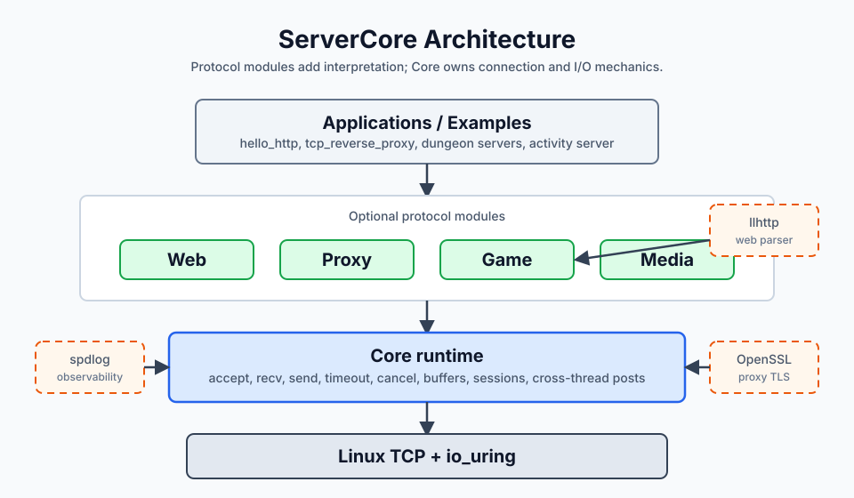
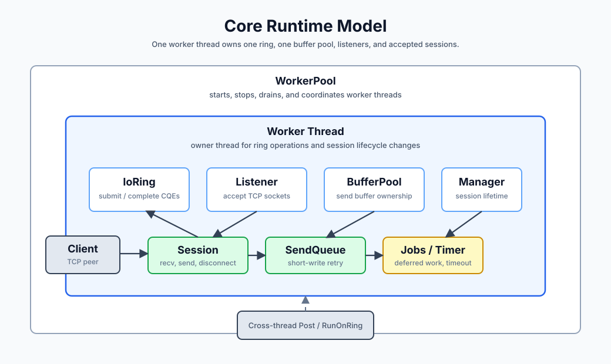
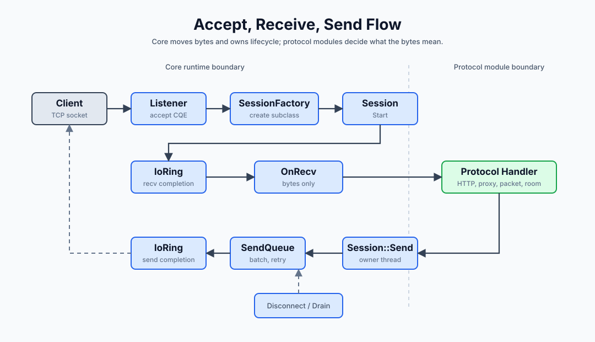

## ServerCore - io_uring based server runtime

ServerCore is a protocol-independent server runtime built on Linux `io_uring`.
Core accepts TCP connections, receives and sends bytes, handles completion
notifications, owns buffers, manages session lifecycle, and moves work across
threads. Protocol modules decide what those bytes mean.

## Core runtime model

## Accept, receive, and send flow

